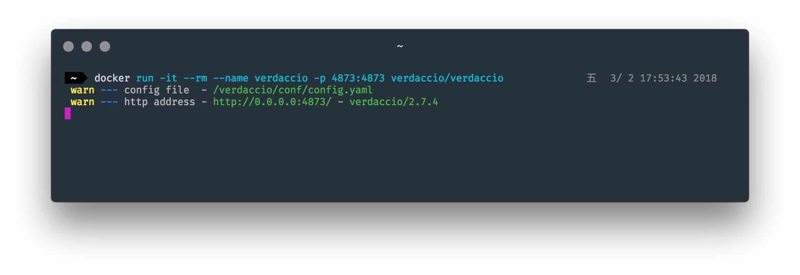
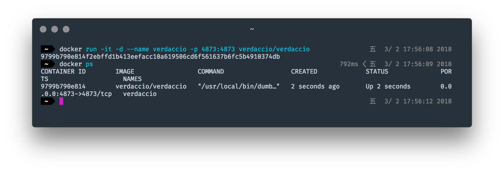
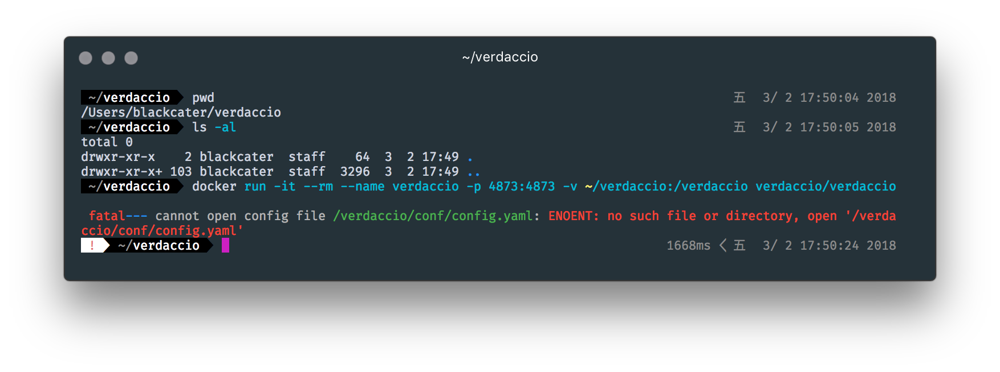
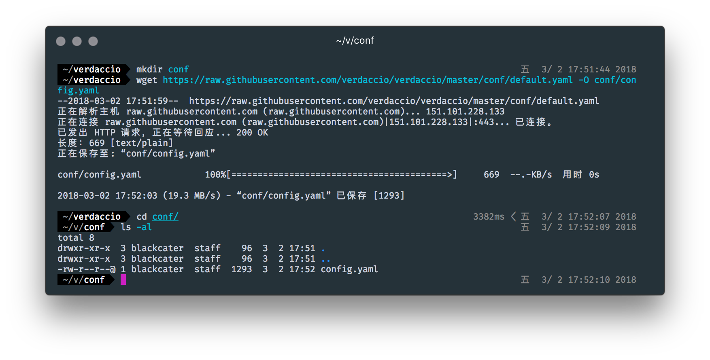
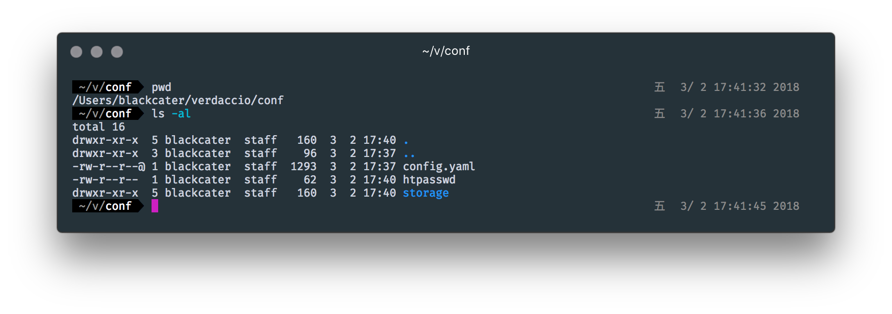

当公司到达一定程度，为了提高前端的开发效率，公司内部会创造一系列的框架或者工具库。这些包肯定是不可以暴露到外网之外的，所以你可以搭建一个私有的 npm。如果你们公司较为富有，其实直接用 npm 的企业版也是很不错的。

## 前言

公司现在前端已经有四人了，技术栈包括 React 和 Vue 等，公司项目十分多。每个项目都有一些共同的部分，例如：JS 和 Native 通信封装，Universal Link，共有的一些工具方法（文件上传，时间价格格式化等）等。想要提高开发效率，第一步就是提取公共部分，减少重复劳动。这些公共部分不能存储在外网。因此需要内网搭建私有 npm 镜像。

## verdaccio

[verdaccio](https://github.com/verdaccio/verdaccio) 是我去年很早就开始关注的一个项目了。这也是这篇文章的主角。

_注意：下面内容牵扯到一些 docker 基础内容，这里不做教学，如果你不了解 docker，可以去看一下阮一峰大神的 [docker 入门基础](http://www.ruanyifeng.com/blog/2018/02/docker-tutorial.html)_

### 拉取镜像

verdaccio 是支持 docker 的。

```bash
# 拉取 verdaccio 镜像
> docker pull verdaccio/verdaccio

# 查看 本地所有镜像
> docker images

## 你可能会看到如下结果
# REPOSITORY            TAG                 IMAGE ID            CREATED             SIZE
# verdaccio/verdaccio   latest              cab129e3f6f6        4 weeks ago         345MB
```

因为镜像默认是从 dockerhub 拉取的，所以你可能会卡在这个地方。

如果你一直拉取不下来，你可以设置代理。我是用的是 [daocloud.io](http://www.daocloud.io/mirror#accelerator-doc)，他提供免费的镜像加速服务。你只需要注册个账号，然后访问 [http://www.daocloud.io/mirror#accelerator-doc](http://www.daocloud.io/mirror#accelerator-doc)，根据页面上的文档设置就行了。

### 启动容器

在 docker 的概念中。镜像你可以理解为模板，容器可以理解为由镜像产生的实例。

```bash
# 创建一个 verdaccio 镜像的容器
> docker run -it --rm --name verdaccio -p 4873:4873 verdaccio/verdaccio

## 你可以看到如下类似的输出
# > docker run -it --rm --name verdaccio -p 4873:4873 verdaccio/verdaccio
# warn --- config file  - /verdaccio/conf/config.yaml
# warn --- http address - http://0.0.0.0:4873/ - verdaccio/2.7.4
```



访问 `http://0.0.0.0:4873/#/` 你会看到如下页面：


然后你就可以按照如上方式进行包的提交了。

但是到这里，这篇文章可没有结束，才是开始。

### 后台运行

运行上一节的指令后，当你按 `ctrl/cmd + c` 之后，网页无法访问了。这里我们需要对上面的指令进行修改

```bash
# 后台运行容器
> docker run -it -d --name verdaccio -p 4873:4873 verdaccio/verdaccio

# 查看正在运行容器
> docker ps

## 你可以看到如下结果
# CONTAINER ID        IMAGE                 COMMAND                  CREATED             STATUS              PORTS                    NAMES
# c7bd43009fbe        verdaccio/verdaccio   "/usr/local/bin/dumb…"   4 seconds ago       Up 3 seconds        0.0.0.0:4873->4873/tcp   verdaccio
```



这时候，容器就在后台运行了。如果服务器挂了，重启之后，你只需要运行：

```bash
# 启动容器
> docker start c7bd43009fbe

# c7bd43009fbe 为上一步生成的 容器 ID 值。
```

这样看似十分完美了对不？但是还是有一些问题。

### 配置 volume

在 docker 中，容器你可以想象成一台机器，容器之间是完全隔离的。在上面的例子里，我们如果上传了一个包，这个包会存在容器内。如果现在 verdaccio 镜像升级了，我们也需要迁移到新版本。那我们只能启动新的容器之后，重新在传原来上传过的包。包少还好，如果包很多的时候，这将会让你头疼至极！


Verdaccio 镜像支持 VOLUME。VOLUMN 就像在你的机器上创建了一个软连接，连接到容器内。这两上传的包会存储在机器上，而不是容器内。

```bash
> docker run -it --rm --name verdaccio -p 4873:4873 -v ~/verdaccio:/verdaccio verdaccio/verdaccio
```

运行上面指令后会报错误：“fatal--- cannot open config file /verdaccio/conf/config.yaml: ENOENT: no such file or directory, open '/verdaccio/conf/config.yaml'”。



意思是我们缺一个文件。这个文件呢，项目的 `README.md` 没有明确告知你，但是官方项目中是有的。 在项目的 [conf](https://github.com/verdaccio/verdaccio/tree/master/conf) 目录下，我们能找到这个文件。我们直接将项目中的 `default.yaml` 文件拷贝到 `~/verdaccio/conf/config.yaml` 中。

```bash
> cd ~/verdaccio
> mkdir conf
> wget https://raw.githubusercontent.com/verdaccio/verdaccio/master/conf/default.yaml -O conf/config.yaml
```



执行完上面的指令之后，你可以在 `~/verdaccio/conf` 目录下发现一个 `config.yaml` 文件。

现在我们再一次执行上面的 `docker run ...` 指令。你会注意到，这次运行成功了。

我们现在试着上传一个包试试！这里我上传了一个 `learn-verdaccio` 的包。

传完包之后，我们可以在 `~/verdaccio/conf` 看到多出来了一些文件和目录。



- `htpasswd` 文件存储着用户的账户密码等信息。
- `storage` 存储着我们上传的一些包，或者如果你开启了包的缓存机制，这里可能也会存着你 `npm install` 下载的包。

到这里，如果以后 verdaccio 镜像升级，我们并不需要做太多修改。只需要在执行一遍上面的 `docker run ...` 即可。

### 自定义 配置

上一节我们看到：在 verdaccio 项目的 `conf` 目录下，还有一个 `full.yaml` 文件。文件里有详细的英文描述，这里我对一些常用的参数进行说明：

- `storage`: 指定包存储的位置，默认 `./storage` 就是 `/verdaccio/conf/storage`
- `web`: 和 web 站点相关的一些配置
- `auth`: 访问权限的配置，可以限制网站注册的人数等。一般来说，都是搭建在内网的，其实可以不用配置这个，默认即可。
- `uplinks`: 配置包搜索的时候，需要查询的 repositories。这里默认配置了 npm，我们可以加上 cnpm。为了节约空间，这里在设置的时候，我们需要打开 `cache: false` 属性。这样 拉取的包不会存储在机器上。
- `packages`: 配置个匹配的包的访问和发布权限等。

剩下一些比方，配置 https，配置 notify，给钉钉发消息等。

下面放一个，我自己正在用的配置。

```yaml
storage: /verdaccio/storage

web:
  title: Mine NPM
  logo: logo.png

auth:
  htpasswd:
    file: /verdaccio/conf/htpasswd

uplinks:
  npmjs:
    url: https://registry.npmjs.org/
    cache: false
  yarnjs:
    url: https://registry.yarnpkg.com/
    cache: false
  cnpmjs:
    url: https://registry.npm.taobao.org/
    cache: false

packages:
  '**':
    access: $all
    publish: $authenticated
    proxy: cnpmjs

logs:
  - { type: stdout, format: pretty, level: http }

notify:
  method: POST
  packagePattern: .*
  packagePatternFlags: i
  headers: [{ 'Content-type': 'application/json; charset=utf-8' }]
  endpoint: https://oapi.dingtalk.com/robot/send?<token>
  content: '{ "msgtype": "actionCard", "actionCard": { "title": "有包更新啦~\\(≧▽≦)/~", "text": "### {{name}} v{{dist-tags.latest}} 发布了 \n **描述** \n\n {{description}} \n\n **作者** \n\n {{maintainers.0.name}} &lt;{{maintainers.0.email}}&gt; \n", "hideAvatar": "0", "btnOrientation": "0", "singleTitle": "查看详情", "singleURL": "http://192.168.3.22:4873/#/detail/{{name}}" } }'
```
