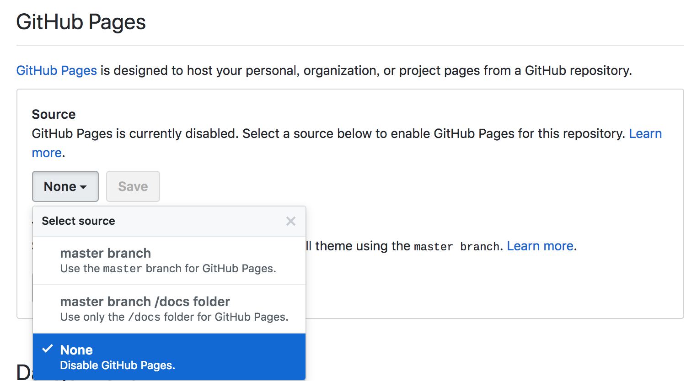
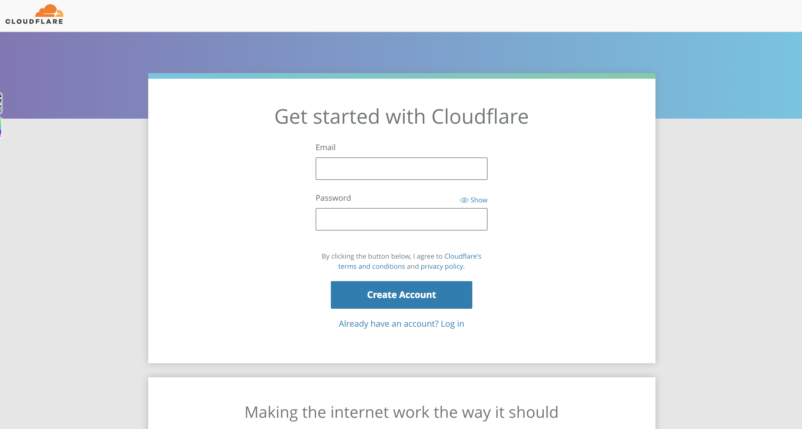
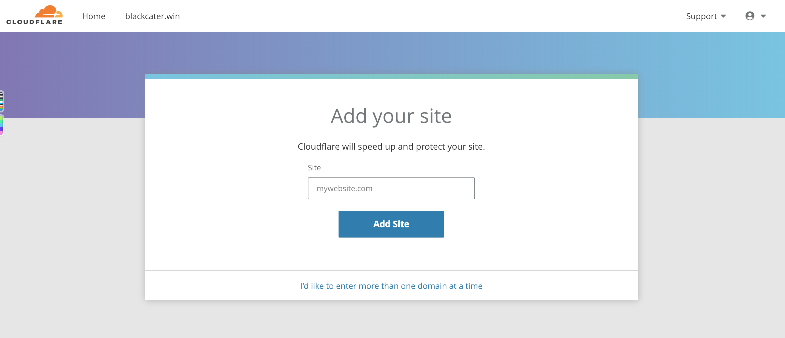
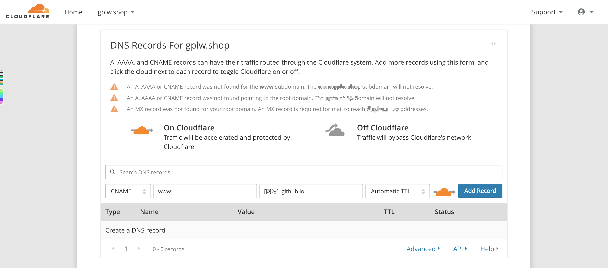
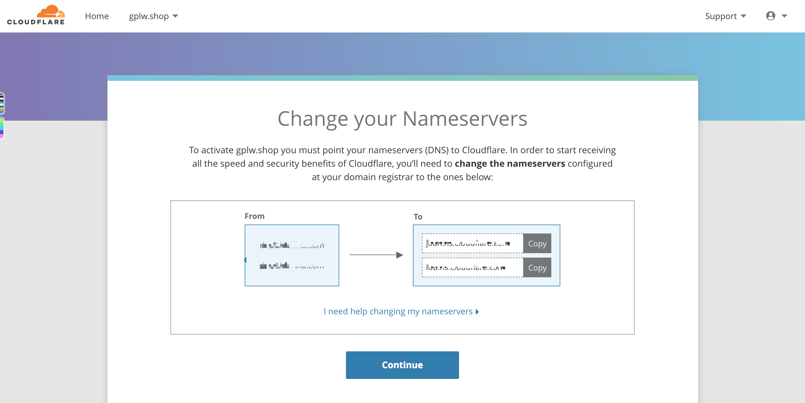
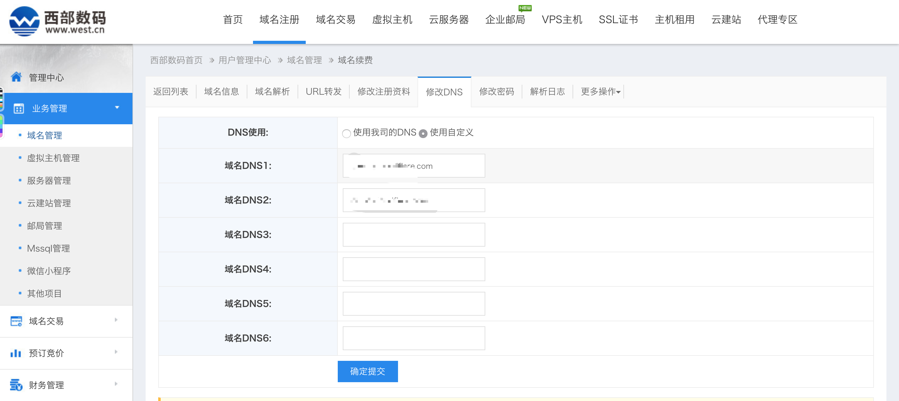
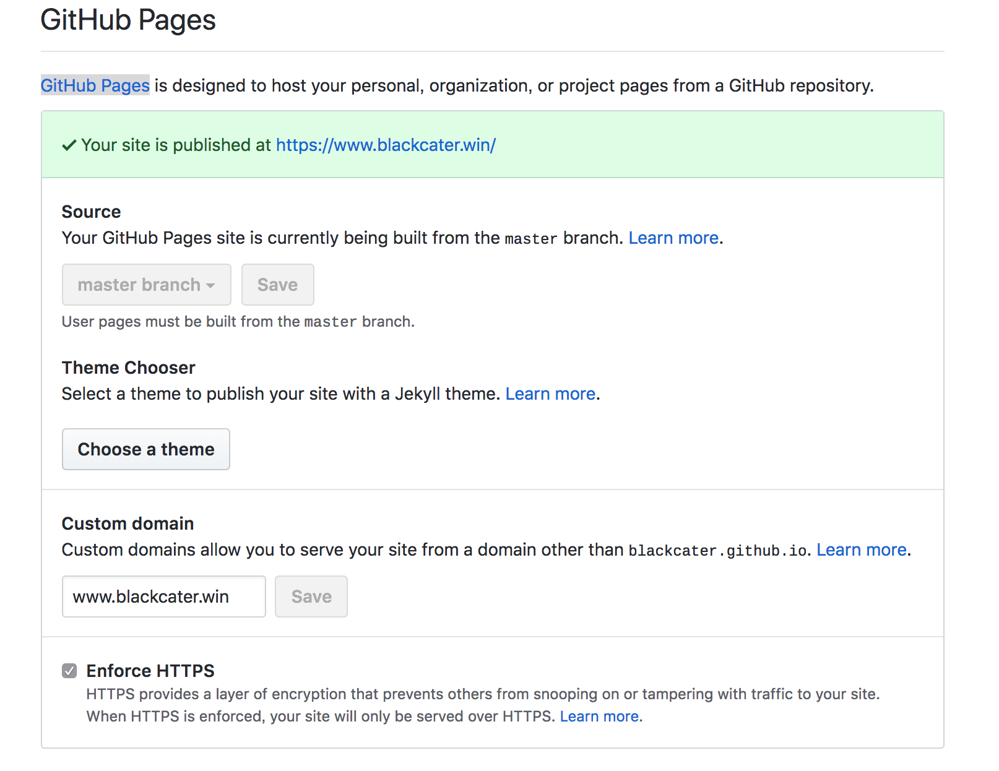

## 什么是静态页面？

在开始正文之前，为了让所有人都能看懂本篇文章，我先讲解一些很基础的知识。如果你对这些都已知晓，请直接看 [CloudFire](#cloudfire) 一节。

静态页面就是没有数据库交互，对每个人显示的内容一样的页面。我们按设计稿撸出来的页面都是静态页面，只要将这些页面放在机器上，暴露一个地址，就可以访问到。

## 将静态页面放在 Github 上

Github 允许你存放静态页面，从而让其他人看到。但是如果你有自己的服务器，你的静态页面也是可以变成动态的。Github 只是提供资源文件的托管，如果你的 JS 文件和远程服务器进行交互，这些 Github 都是不予限制的。

在 Github 上创建的任何一个项目，默认有一个 `master` 分支。Github 可以为每一个项目生成一个访问的地址，基本格式为: `[项目名].[用户名].github.io`。

默认情况下，你将文件上传到项目的 `gh-pages` 分支即可。很多项目都是这么做的。但是 Github 也支持其他的方式：

前往项目的**设置**目录下，你会看到有一个 `source` 选项：

- `master branch`: 将 master 分支作为静态页面存放分支。
- `master branch /docs folder`: 将 master 分支下的 `/docs` 目录作为静态页面存放分支。
- `None`: 默认选项，将 `gh-pages` 分支作为静态页面存放分支。

对于个人博客，推荐创建一个项目：`[用户名].github.io`。并将静态页面传入该项目的 `master` 分支上。之后访问 `[用户名].github.io` 就能访问到页面了。

*注: 静态页面上传完之后，并不是立即就能访问的，因为中间有 CDN 同步之内的一些操作，有一定的延迟，等一会就行了。*

## 开发静态页面的技术选型

Github 上有很多静态化技术，如:

- 早期很出名的 [jekyll](https://github.com/jekyll/jekyll)。
- 后来 Node 流行，出现了 [hexo](https://github.com/hexojs/hexo)。
- Go 语言写的 [hugo](https://github.com/gohugoio/hugo)。
- [React](https://github.com/facebook/react) / [Vue](https://github.com/vuejs/vue) / [Angular](https://github.com/angular/angular) 等前端框架书写的网站。

在最后一条中，我已经将 [react-static](https://github.com/nozzle/react-static)，[gatsby](https://github.com/gatsbyjs/gatsby)，[Docusaurus](https://github.com/facebook/Docusaurus) 以及 [vuepress](https://github.com/vuejs/vuepress) 包含进去了 😄。

甚至，你可以不选上面任何技术方案，直接手写。不过为了效率着想，还是选择成熟的方案为好。

## 修改访问域名

现在我们的静态页面已经可以访问了，但是呢访问地址肯定让很多人都不爽。不过没关系，Github 支持你修改域名。

### 购买域名

为了改域名，那得先买个域名。买域名可以去[阿里云](https://cn.aliyun.com/)，[西部数码](https://www.west.cn/)以及国外的[Godaddy](https://sg.godaddy.com/zh/)等等。

买域名的过程我就不说了，和购物一样没啥区别。买的时候需要小心点，别被默认选项坑了就行（默认会勾选一些增值服务等）。

很多域名可能会做活动，首年很便宜，有的域名可能还免费，不过找一个自己满意的域名肯定十分的蛋疼，大家要有耐心啊。

### A，CNAME 和 MX 记录

我们都知道，当我们输入一个网站例如：`http://www.qq.com/` 为何能到达腾讯的门户网站？为何输入别的就不行？这个就是在你访问的 DNS 机器上有这么一条记录。这条记录就像网址的身份证一样，身份证如果没了，那么你这个人相当于也没了。全球有13台跟根服务器，在上面可以找到你的这条记录的。其他遍布全球的 DNS 服务器，都是同步于跟服务器的。

A 记录用来指定域名对应的 IP 地址的。通俗来说就是告诉 DNS，当你输入域名的时候给你引导到对应的服务器。

CNAME 记录也叫别名记录，允许你将多个名字映射到同一台计算机。

MX 记录也叫邮件路由记录，用户可以将该域名下的邮件服务器指向自己的邮件服务器上。

### 修改记录

各个域名服务商的控制台都各不相同，但大同小异。这里我以 [西部数码](https://www.west.cn/) 的为例（因为我的域名是在西部数码买的 😭）。

在 “域名管理” 目录下，找到 “域名解析” 服务。

我们添加一条 CNAME 记录：将 `www.[域名]` 映射到 `[网站].github.io` 地址上。

之后我们在静态项目更目录下补上一个 `CNAME` 文件，`CNAME` 文件内写上：`www.[域名]`。

提交代码之后等待一会儿即可。

## CloudFire

[CloundFire](https://www.cloudflare.com/) 是国外 DNS 服务提供商。我们需要靠他才能让我们的页面支持 HTTPS。

- 首先，我们创建一个账号。
- 创建一个项目，这里填写自己购买的域名。
- 创建之后会进行 DNS 查询，可能会查询失败，失败之后需要我们手动添加一下。
- 之后我们获取到了两个 DNS 地址 
- 由于我的域名在 西部数码 购买的，所以这里我以西部数码为例对 DNS服务器进行修改 
- 点击下一步之后，我们就等待几个小时就行了（可能几分钟就行了）。

现在，我们地址以 `https` 开头进行访问，是不是已经可以看到自己的网站了？Cool！

## 强制 HTTPS 访问

虽然我们的网站可以 `https` 进行访问，但是我们 `http` 也能进行访问。这里我们需要去 Github 上设置一下：

在项目的设置页面下，我们可以找到一个 `Enforce HTTPS` 选项，我们勾选上它，等待一会~

现在访问 `http` 地址试试？是不是立即就跳转到 `https` 去了？

最终效果就像[我的博客](https://www.blackcater.win)效果一样。
